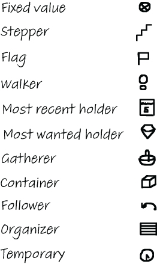

# Notes from The Programmer's Brain

## EXERCISE 2.5 - Reading unfamiliar code

Selecting the right kinds of beacons to use in code can take some practice. Use this exercise to deliberately practice using beacons in code.

Step 1: Select code

For this exercise select an unfamiliar codebase, but do select one in a programming language that you are familiar with. If possible, it would be great to do this exercise on a codebase where you know someone familiar with the details. You can then use that person as a judge of your understanding. In the codebase, select one method or function.

Step 2: Study code

Study the selected code and try to summarize the meaning of the code.

Step 3: Actively notice beacons that you use

Whenever you have an “aha” moment where you get a bit closer to the functionality of the code, stop and write down what it was that led you to that conclusion. This could be a comment, a variable name, a method name, or an intermediate value—all of those can be beacons.

Step 4: Reflect

When you have a thorough understanding of the code and a list of beacons, reflect using these questions:

What beacons have you collected?
Are these code elements or natural language information?
What knowledge do they represent?
Do they represent knowledge about the domain of the code?
Do they represent knowledge about the functionality of the code?
Step 5: Contribute back to the code (optional)

Sometimes, but not always, the beacons you have selected could be improved or extended. Or the code might be in need of additional beacons that aren’t there yet. This is a great moment to enrich the code with the new or improved beacons. Because you weren’t familiar with the code before this exercise, you have a good perspective on what would help someone else who is new to the codebase too.

Step 6: Compare with someone else (optional)

If you have a coworker or friend who wants to improve their beacon use too, you can do this exercise together. It can be interesting to reflect on the differences both of you had in reproducing code. Because we know there are large differences between beginners and experts, this exercise might also help you understand your level of skill in a programming language relative to someone else’s.

## EXERCISE 2.6 - Chunking

This exercise helps you recognize what concepts you are familiar with and what concepts are harder for you by testing your code reading memory. The underlying assumption is that, as shown by the experiments outlined, familiar concepts are easier to remember. What you can remember is what you know, so these exercises can be used for (self) diagnosis of your code knowledge.

Step 1: Select code

Select a codebase you are somewhat familiar with—maybe something you work with regularly, but not mainly. It can also be something you personally wrote a while ago. Make sure you have at least some knowledge of the programming language the code is written in. You have to know more or less what the code does, but not know it intimately. You want to be in a situation similar to the chess players; they know the board and the pieces but not the setup.

In the codebase, select a method or function, or another coherent piece of code roughly the size of half a page, with a maximum of 50 lines of code.

Step 2: Study code

Study the selected code for a bit, for a maximum of two minutes. Set a timer so you don’t lose track of the time. After the timer runs out, close or cover the code.

Step 3: Reproduce the code

Take a piece of paper, or open a new file in your IDE, and try to recreate the code as best as you can.

Step 4: Reflect

When you are sure you have reproduced all the code you possibly can, open the original code and compare. Reflect using these questions:

Which parts did you produce correctly with ease?
Are there any parts of the code that you reproduced partly?
Are there parts of the code that you missed entirely?
Do you understand why you missed the lines that you did?
Do the lines of code that you missed contain programming concepts that are unfamiliar to you?
Do the lines of code that you missed contain domain concepts that are unfamiliar to you?
Step 5: Compare with someone else (optional)

If you have a coworker who wants to improve their chunking abilities too, you can do this exercise together. It can be very interesting to reflect on the differences in the code you reproduce. Because we know there are large differences between beginners and experts, this exercise might also help you understand your level of skill in a programming language relative to someone else’s.

## Chapter 3

Reading a hello.txt file and writing all lines to the command line
Formatting a date in the order of day-month-year
A regular expression matching words that start with “s” or “season”

### EXERCISE 3.1 Think of the top 10 programming concepts

Think of the top 10 programming concepts you always have trouble remembering.
Make a set of flashcards for each of the concepts and try using them.

### EXERCISE 3.2 learning a new programming concept

Use this exercise the next time you learn a new programming concept. Answering the following questions will help you elaborate and strengthen the new memory:

* What concepts does this new concept make you think of? Write down all the related concepts.
* Then, for each of the related concepts you can think of, answer these questions:
  * Why does the new concept make me think of this concept that I already know?
  * Does it share syntax?
  * Is it used in a similar context?
  * Is this new concept an alternative to one I already know?
* What other ways do you know to write code to achieve the same goal? Try to create as many variants of this code snippet as you can.
* Do other programming languages also have this concept? Can you write down examples of other languages that support similar operations? How do they differ from the concept at hand?
* Does this concept fit a certain paradigm, domain, library, or framework?

## Table 4.1 Types of cognitive load (view table figure)

| Load type       | Brief explanations                                            |
| --------------- | ------------------------------------------------------------- |
| Intrinsic load  | How complex the problem is in itself                          |
| Extraneous load | What outside distractions add to the problem                  |
| Germane load    | Cognitive load created by having to store your thought to LTM |

## EXERCISE 4.1

The next time you read unfamiliar code, try to monitor your own cognitive load. When the code is hard to process and you feel the need to make notes or follow the execution step by step, it is likely you are experiencing a high cognitive load.

When you experience high cognitive load, it is worthwhile to examine which parts of the code are creating the different types of cognitive load. You can use the following table to analyze this.

| Lines of Code | Instrinsic cognitive load | Extraneous cognitive load |
| ------------- | ------------------------- | ------------------------- |
|               |                           |                           |
|               |                           |                           |

## 4.2 Techniques to reduce cognitive load

### 4.2.1 Refactoring

### 4.2.2 Replacing unfamiliar language constructs

### 4.2.3 Code synonyms are great additions to a flashcard deck

## 4.3 Memory aids to use when your working memory is overloaded

### 4.3.1 Creating a dependency graph

### 4.3.2 Using a state table

|       | N   | N2  | B$  | N1  |
| ----- | --- | --- | --- | --- |
| Init  | 7   | 7   | -   | 7   |
| Loop1 |     | 3   | 1   | 3   |
| Loop2 |     |     |     |     |

Follow these steps to create a state table:

1. Make a list of all the variables. If you have already created a dependency graph for this program, as described in the previous section, it will be easy to list the variables because you’ll have circled all of them in the same color.
2. Create a table and give each variable its own column. In the state table, each variable will get one column in which its intermediate values can be recorded, as shown in figure 4.7.
3. Add one row to the table for each distinct part of the execution of the code. Code that contains complex calculations will most likely also contain some complex dependencies, such as a loop depending on a calculation, or a complicated if statement. Rows in the state table represent separate parts of the dependencies. For example, as shown in figure 4.7, a row can represent one iteration in a loop, preceded by the initialization code. Alternatively, a row could represent a branch in a large if statement, or simply a group of coherent lines of code. In extremely complex and terse code, one row in the table might even represent one line of code.
4. Execute each part of the code and then write down the value each variable has in the correct row and column.

## text structure knowledge and plan knowledge

* text structure knowledge: relates to surface-level understanding of parts of the program
* plan knowledge:  represents understanding what a programmer planned when they created the program or what they were aiming to achieve.
